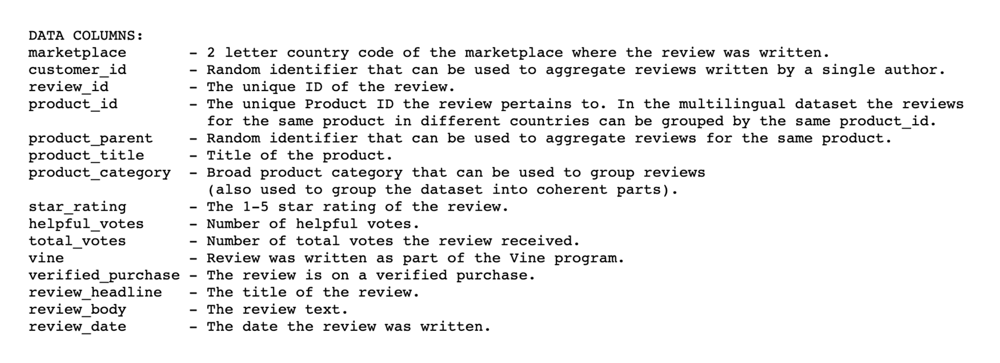
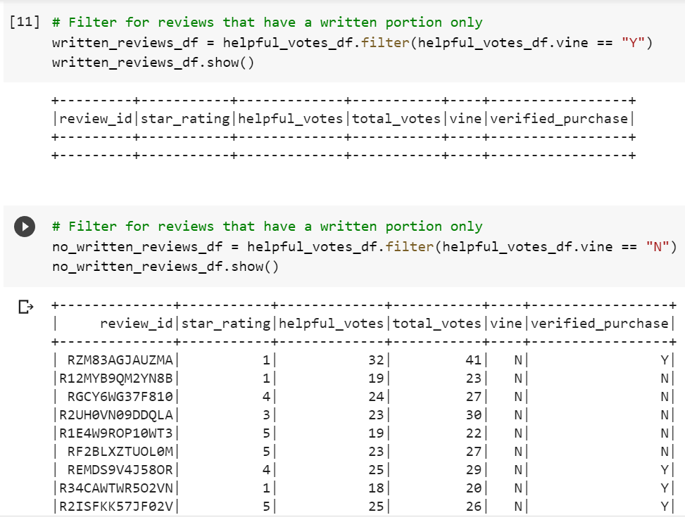
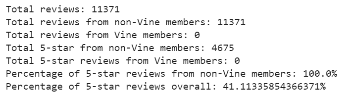

# Amazon Vine Analysis

## Overview of the analysis
We have been tasked with analyzing Amazon reviews written by members of the paid Amazon Vine program.
The dataset was obtained and selected from a pool. The data selected can be found [here](https://s3.amazonaws.com/amazon-reviews-pds/tsv/amazon_reviews_us_Digital_Video_Download_v1_00.tsv.gz).

The dataset uses the following schema:

## Results
The data was loaded into an Amazon RDS. The schema was loaded using Postgres, and populated via a Google notebook using pySpark. The data was extracted into a DataFrame and transformed for analysis. It was filtered for reviews with a percentage of helpful votes higher than 50% and separating those that had a written description vs. the ones that did not.
- The results show all of the reviews in this sample are from non-Vine reviews.
- Of these, zero reviews were from Vine members and 11,371 from non-Vine members.

- 4,675 were non-Vine 5-star reviews.
- 41% are 5-star reviews that are non-Vine, vs. 0% 5-star reviews for Vine members.

## Summary
We could not determine from this sample if there is any positivity bias, since there are no reviews from Vine members. This analysis should be repeated with other samples to determine this with some certainty.